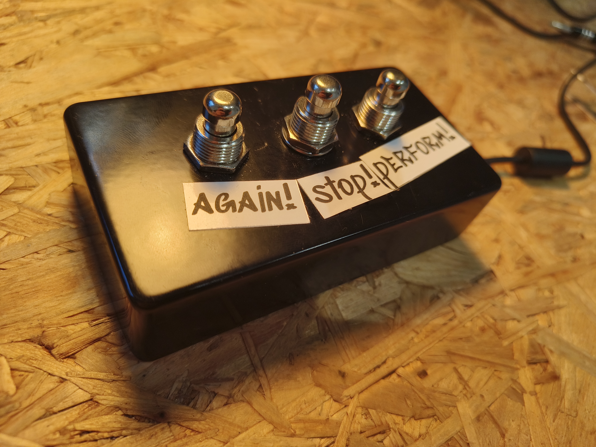
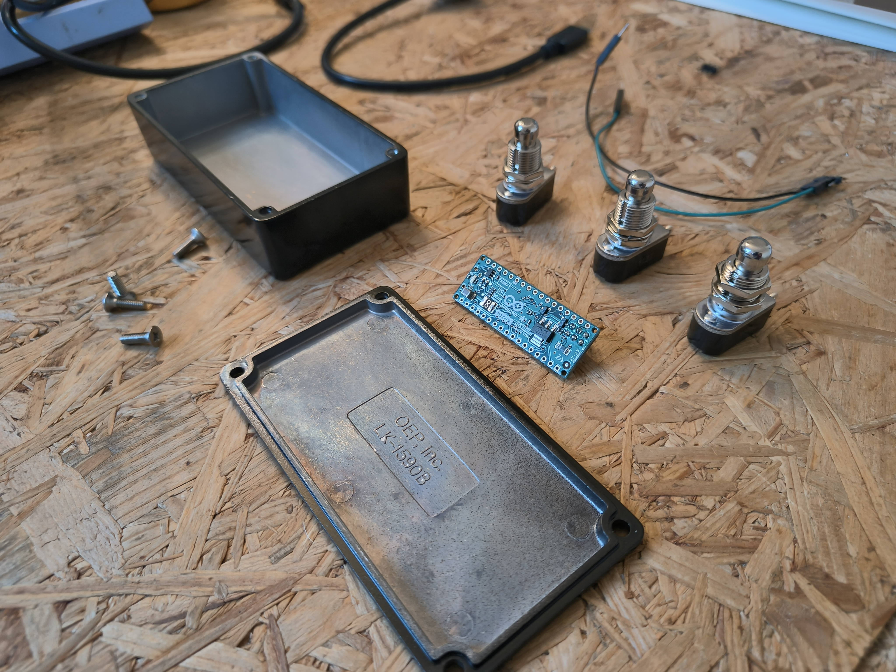

# Yousician foot pedal

The is a simple USB stompbox to control [Yousician](https://yousician.com/).   
The stompbox has 3 buttons and simulates keyboard presses using [keyboard.h](https://reference.arduino.cc/reference/en/language/functions/usb/keyboard/) (beware: doesn't work on every Arduino).   
This example uses the Arduino Micro and some sweet buttons from [Tonefactory](https://www.tonefactory.nl).   

 

   

The following key presses are simulated:      
- `R` : reset the song
- `space` : toggles between pauze and play
- `P` : toggles between practice and perfom mide

 

# Hardware
- [Arduino Micro](https://store.arduino.cc/en-be/products/arduino-micro) (Keyboard.h is not available for Arduino nano, nano 3IOT & ESP32)
- [3 x Footswitch Soft Click, SPST, momentary](https://www.tonefactory.nl/footswitch-soft-click-spst-momentary)
- [Stompbox casing](https://www.tonefactory.nl/effect-behuizing-1590b-style-black)

 

# Code
* ⌨️ [Arduino Code](pedal.ino)

# Wiring
- `Arduino` D2, D3 & D4  --> `button` power sides (left or right, doesn't matter)
- `button` ground sides -- > connect all to common ground + `Arduino` GND

 

# Construction
- `Solder` wires   
- `Drill` holes in casing (M12) to mount the buttons
- `Print` and `mount` a small Arduino case to the botom plate
- `Drill` holes to mount the Arduino Micro to the bottom plate (M1.2)
- `Tap` M1.4 threads in the bottom plate
- `Mill` a hole for the USB connector
- `glue` small felt pads on the bottom
- `print` or `draw` text and graphics

